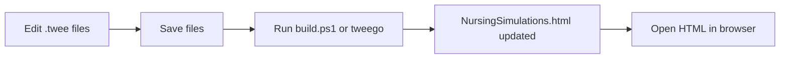

# Nursing Simulation Framework

SugarCube 2 nursing simulation storyboard for faculty. Source lives in `.twee` files; the playable file is compiled to **`NursingSimulations.html`**.

<details>
<summary># Project layout</summary>

```text
Twine Simulation App/
  build.ps1                 # Compile script (recommended)
  NursingSimulations.html   # Compiled output — open in browser
  tweego-2.1.1-windows-x64/ # Local Tweego compiler
  audio/                    # Shared audio (e.g. hold_music.mp3)
  twee/
    Framework.twee          # StoryData, header/footer, widgets, CSS, StoryScript
    Master_Menu.twee        # Start + REGN course hubs
    Sims/
      Sim_Example.twee      # Example simulation (add more sims here)
  archive/                  # Old sources — not compiled
```
</details>
<details>
  <summary># Manual Tweego recompile guide</summary>

Use this after you edit `.twee` files in Cursor, VS Code, Visual Studio, or any text editor.

## What you edit vs what you open

| Edit these (source) | Do not edit for content changes |
|---------------------|----------------------------------|
| `twee/Framework.twee` | `NursingSimulations.html` (output only; overwritten each build) |
| `twee/Master_Menu.twee` | |
| `twee/Sims/*.twee` | `archive/` (not included in compile) |

**Save all `.twee` files before building.**

## Easiest method: run the build script

1. Open a terminal in the **project root** (the folder that contains `build.ps1` and the `twee` folder).
2. Run:

```powershell
.\build.ps1
```

3. On success you should see something like: `Built: ...\NursingSimulations.html (3 source files)`.
4. Open or refresh `NursingSimulations.html` in your browser (**Ctrl+F5** for a hard refresh).

### In Visual Studio / VS Code

- **Terminal → New Terminal** (ensure the working directory is the project root).
- Run `.\build.ps1`.
- Optional: add an editor task that runs this script on demand.

`build.ps1` automatically uses `tweego-2.1.1-windows-x64\tweego.exe` when that folder exists in the project.

## Manual Tweego command (without the script)

From the project root in PowerShell:

```powershell
cd "path\to\Twine Simulation App"

& ".\tweego-2.1.1-windows-x64\tweego.exe" -f sugarcube-2 -o "NursingSimulations.html" `
  (Get-ChildItem "twee\*.twee").FullName `
  (Get-ChildItem "twee\Sims\*.twee").FullName
```

This matches what `build.ps1` does:

- **Format:** `sugarcube-2` (bundled inside `tweego-2.1.1-windows-x64\storyformats\`)
- **Output:** `NursingSimulations.html` in the project root
- **Inputs:** every `.twee` file in `twee\` and `twee\Sims\`

If `tweego` is on your PATH, you can replace the exe path with `tweego`.

## Workflow after editing



## Common pitfalls

- **Unsaved files** — Tweego reads from disk; save in the editor first.
- **Duplicate `StoryTitle` / `StoryData`** — Only `twee/Framework.twee` should define these. Sim files should contain passages only (Tweego warns if sim files add duplicates).
- **New sim file not compiled** — Put new simulations under `twee\Sims\` with a `.twee` extension; `build.ps1` picks them up automatically.
- **Audio not playing** — Audio paths are relative to the HTML file; keep the `audio\` folder next to `NursingSimulations.html`.
- **Browser shows old version** — Hard refresh (Ctrl+F5) or close the tab and reopen the HTML file.

## Optional checks

- **List formats** (if `-f` fails):

```powershell
.\tweego-2.1.1-windows-x64\tweego.exe --list-formats
```

- **Verbose file list:**

```powershell
.\tweego-2.1.1-windows-x64\tweego.exe -f sugarcube-2 -o NursingSimulations.html --log-files `
  (Get-ChildItem "twee\*.twee").FullName `
  (Get-ChildItem "twee\Sims\*.twee").FullName
```

## Twine GUI vs Tweego

You can use the Twine editor for visual layout, but this project is set up for **Tweego + `.twee` files**. If you export from Twine, avoid overwriting the split `twee\` sources unless you intend to migrate back.

**Day-to-day workflow:** edit `.twee` → `.\build.ps1` → test `NursingSimulations.html`.

## Quick author notes

- **Launch a sim:** `<<launchSim "SimStart_Passage" "Name" "DOB" "Allergies" "REGN 15P">>` on course hub passages.
- **Footer progression links:** add a passage named `{PassageName}_ProgressLinks` with the `[[links]]` only.
- **Sim audio:** `<<cacheSimAudio "track_id" "audio/file.mp3">>` on the sim’s `_Start` passage (track IDs must not contain spaces).
- **Assessment table:** `<<displayAssessment>>` in sim passages; defaults in `{Sim}_AssessmentDefaults` passage.
</details>
