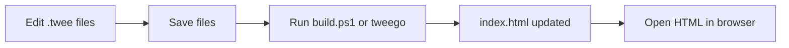

# Nursing Simulation Framework

SugarCube 2 nursing simulation storyboard for faculty. Source lives in `.twee` files; the playable file is compiled to **`index.html`** (GitHub Pages serves this as the site entry point).

<details>
<summary>GitHub Pages</summary>

Publish from the repo root on branch `main`. After each build, commit `index.html` and the `audio/` folder so paths like `audio/common/hold_music.mp3` resolve on the live site.

</details>

<details>
<summary># Project layout</summary>

```text
Twine Simulation App/
  build.ps1                 # Compile script (recommended)
  index.html   # Compiled output — open in browser
  tweego-2.1.1-windows-x64/ # Local Tweego compiler
  audio/                    # Shared audio (e.g. hold_music.mp3)
  twee/
    Framework.twee          # StoryData, header/footer, widgets, CSS, StoryScript
    Master_Menu.twee        # Start + REGN course hubs
    Sims/
      Sim_Example.twee      # Example simulation (add more sims here)
  archive/                  # Old sources — not compiled
```
</details>
<details>
  <summary># Manual Tweego recompile guide</summary>

Use this after you edit `.twee` files in Cursor, VS Code, Visual Studio, or any text editor.

## What you edit vs what you open

| Edit these (source) | Do not edit for content changes |
|---------------------|----------------------------------|
| `twee/Framework.twee` | `index.html` (output only; overwritten each build) |
| `twee/Master_Menu.twee` | |
| `twee/Sims/*.twee` | `archive/` (not included in compile) |

**Save all `.twee` files before building.**

## Easiest method: run the build script

1. Open a terminal in the **project root** (the folder that contains `build.ps1` and the `twee` folder).
2. Run:

```powershell
.\build.ps1
```

3. On success you should see something like: `Built: ...\index.html (3 source files)`.
4. Open or refresh `index.html` in your browser (**Ctrl+F5** for a hard refresh).

### In Visual Studio / VS Code

- **Terminal → New Terminal** (ensure the working directory is the project root).
- Run `.\build.ps1`.
- Optional: add an editor task that runs this script on demand.

`build.ps1` automatically uses `tweego-2.1.1-windows-x64\tweego.exe` when that folder exists in the project.

## Manual Tweego command (without the script)

From the project root in PowerShell:

```powershell
cd "path\to\Twine Simulation App"

& ".\tweego-2.1.1-windows-x64\tweego.exe" -f sugarcube-2 -o "index.html" `
  (Get-ChildItem "twee\*.twee").FullName `
  (Get-ChildItem "twee\Sims\*.twee").FullName
```

This matches what `build.ps1` does:

- **Format:** `sugarcube-2` (bundled inside `tweego-2.1.1-windows-x64\storyformats\`)
- **Output:** `index.html` in the project root
- **Inputs:** every `.twee` file in `twee\` and `twee\Sims\`

If `tweego` is on your PATH, you can replace the exe path with `tweego`.

## Workflow after editing



## Common pitfalls

- **Unsaved files** — Tweego reads from disk; save in the editor first.
- **Duplicate `StoryTitle` / `StoryData`** — Only `twee/Framework.twee` should define these. Sim files should contain passages only (Tweego warns if sim files add duplicates).
- **New sim file not compiled** — Put new simulations under `twee\Sims\` with a `.twee` extension; `build.ps1` picks them up automatically.
- **Audio not playing** — Audio paths are relative to the HTML file; keep the `audio\` folder next to `index.html`.
- **Browser shows old version** — Hard refresh (Ctrl+F5) or close the tab and reopen the HTML file.

## Optional checks

- **List formats** (if `-f` fails):

```powershell
.\tweego-2.1.1-windows-x64\tweego.exe --list-formats
```

- **Verbose file list:**

```powershell
.\tweego-2.1.1-windows-x64\tweego.exe -f sugarcube-2 -o index.html --log-files `
  (Get-ChildItem "twee\*.twee").FullName `
  (Get-ChildItem "twee\Sims\*.twee").FullName
```

## Twine GUI vs Tweego

You can use the Twine editor for visual layout, but this project is set up for **Tweego + `.twee` files**. If you export from Twine, avoid overwriting the split `twee\` sources unless you intend to migrate back.

**Day-to-day workflow:** edit `.twee` → `.\build.ps1` → test `index.html`.

## Quick author notes

- **Launch a sim:** `<<launchSim "SimStart_Passage" "Name" "DOB" "Allergies" "REGN 15P">>` on course hub passages.
- **Footer progression links:** add a passage named `{PassageName}_ProgressLinks` with the `[[links]]` only.
- **Sim audio:** `<<cacheSimAudio "track_id" "audio/file.mp3">>` on the sim’s `_Start` passage (track IDs must not contain spaces).
- **Assessment table:** `<<displayAssessment>>` in sim passages; defaults in `{Sim}_AssessmentDefaults` passage.

## CCEI 2.0 faculty sidebar (sim passages)

On `[sim]` passages, the left UI bar shows the **Creighton Competency Evaluation Instrument (CCEI) 2.0**. Only competencies **1–25** are scored (0 / 1 / NA). Sim-specific text is **context only**—it does not add extra score rows.

1. Add a config passage, e.g. `ExampleSim_CCEI`, with macros (no `[sim]` tag required).
2. On sim start: `<<loadSimCCEI "ExampleSim_CCEI">>` (with `<<loadAssessmentDefaults>>`).

```twee
:: ExampleSim_CCEI
<<cceiSimTitle "Example Simulation">>
<<cceiContext "clinicalJudgment" "recognizeCues" "Faculty guidance for this subcategory...">>
<<cceiNote 6 "student recognizes signs of nausea related to small bowel obstruction">>
<<cceiExpandCategory "clinicalJudgment">>
<<cceiExpandCategory "communication">>
<<cceiShrinkItem 24>>
```

| Macro | Purpose |
|-------|---------|
| `<<cceiSimTitle "title">>` | Simulation name in the header and PDF (read-only in the panel) |
| `<<cceiNote id "text">>` | Context under competency **id** (1–25); faculty still scores that item |
| `<<cceiContext category subcategory "text">>` | Context above a Clinical Judgment subcategory block |
| `<<cceiContext category "text">>` | Context for Communication / Quality & Safety / Professionalism (two args) |
| `<<cceiExpandCategory id>>` | Include category (`clinicalJudgment`, `communication`, `qualitySafety`, `professionalism`) |
| `<<cceiExpandSubcategory category subcategory>>` | Optional: only listed subcategories under Clinical Judgment |
| `<<cceiShrinkItem n>>` | Omit competency **n** from this sim (excluded from totals) |

If no `<<cceiExpandCategory>>` macros are listed, **all four** categories appear. If one or more are listed, **only** those categories appear. Scores persist while navigating sim passages; **Repeat Sim** restores the snapshot from sim start; **Main Menu** clears CCEI via `<<clearCCEI>>`.

**Header** (stored in `$ccei`): centered simulation title (from `<<cceiSimTitle>>`); then student name, evaluator name, and evaluation date (defaults to today on a new sim run); then scoring guidelines (0 / 1 / NA, with a note that NA competencies are hidden by default when configured in the sim).

### CCEI expand overlay (sidebar tray)

During a sim, the **CCEI 2.0** tray sits in the left UI bar (mini earned/possible totals). The full evaluation form opens as an overlay over the passage area:

- **Hover** the tray (desktop) — temporary preview; closes when the pointer leaves (unless pinned).
- **Expand** — open the overlay until **Collapse**.
- **Pin** — keep the overlay open while moving between passages; click **Pin** again to unpin.
- **Collapse** (in the overlay header) — close the overlay and return to tray-only.

The expanded form uses a **two-column layout**: competencies and scores on the left, subcategory and overall comments on the right (stacks on narrow screens). At the bottom:

- **Export CSV** — one row per **visible** competency (respects shrink and category filters), with metadata on each row for filtering in Excel. Columns: `exportedAt`, `simTitle`, `runSequence`, `courseHub` (`$returnHub`), `simStartPassage` (`$currentSimStart`), `evalDate`, `studentName`, `evaluatorName`, `competencyId`, `competencyLabel`, `category`, `subcategory`, `score`, `itemNote`, `subcategoryComment`, `overallComment`, `earned`, `possible`, `percent`. Filename pattern: `{simTitle}-{evalDate}-{runSequence}.csv` (e.g. `Example_Simulation-2026-06-04-1.csv` for the first student that day, `-2` for the next **Repeat Sim** run). Sequence resets per calendar day per simulation title (stored in the browser so faculty can export many runs and import all files at end of day).
- **Export PDF** — report built from evaluation data using a [pdfmake](https://pdfmake.github.io/docs/) template (vector text, single-column layout, predictable page breaks). Keep `lib/pdfmake/` next to `index.html` for offline/`file://` use. If pdfmake scripts are missing, the browser **Print** dialog opens so you can choose **Save as PDF**.

**Shared master workbook (faculty / accreditation):** There is no in-app database. After each evaluation, download CSV and **append** rows into a shared Excel or OneDrive master sheet. Use `simTitle`, `courseHub`, and `exportedAt` to filter runs over time and compare changes. PDF remains useful for a single printable snapshot; CSV is the source of truth for longitudinal review.

Rebuild after `.twee` edits: `.\build.ps1`.
